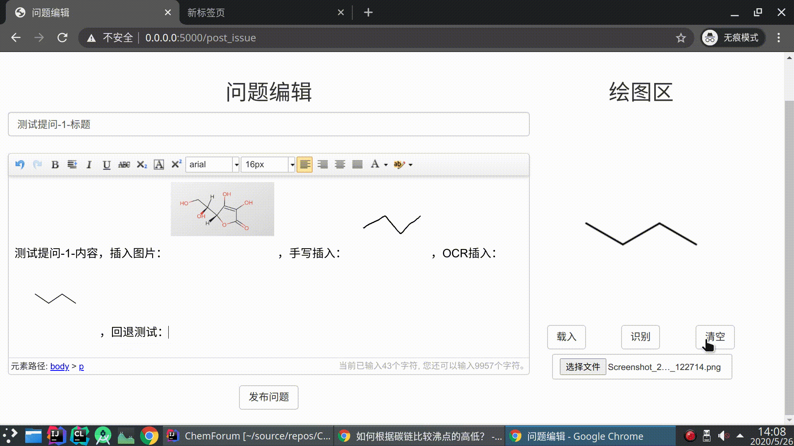
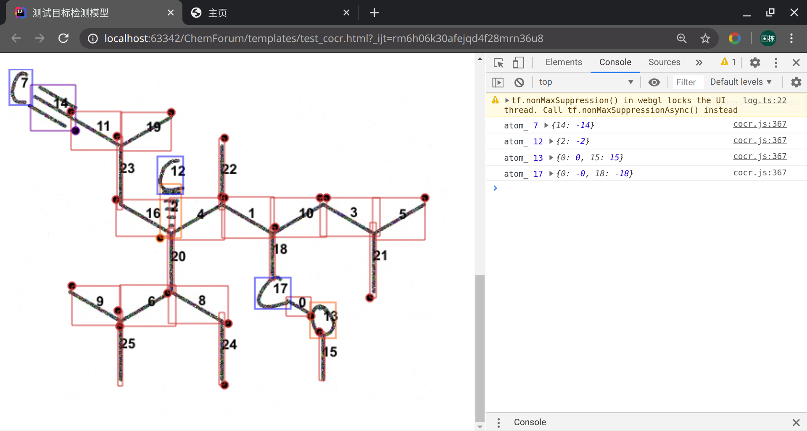
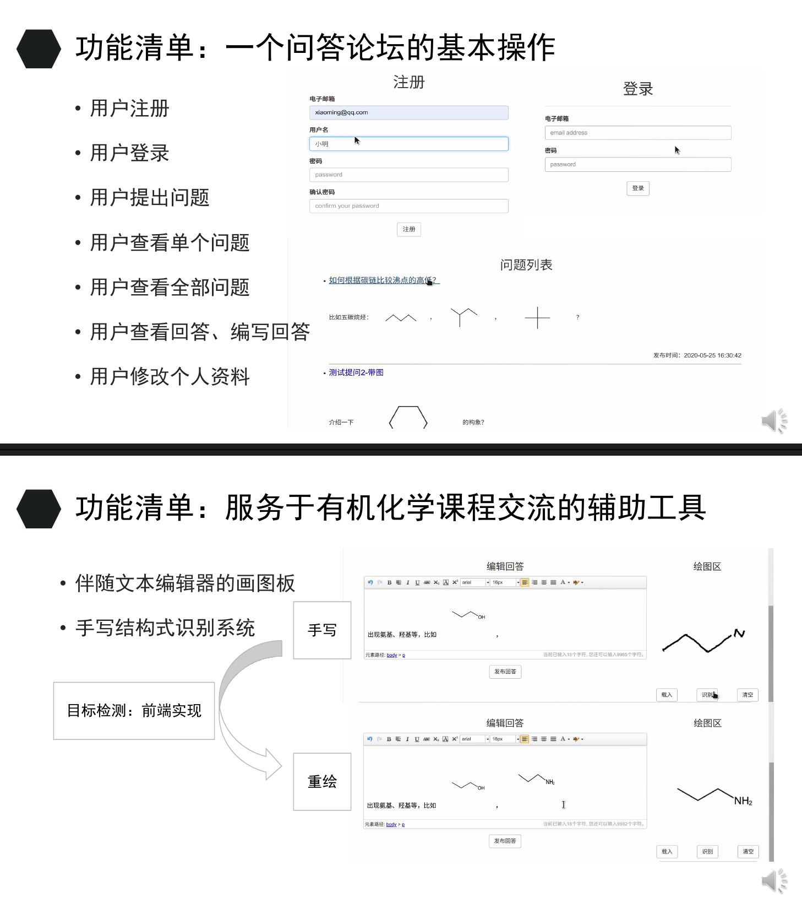

# 课程设计 有机化学课程论坛



## 说明
* 目标检测模型和结构综合算法在前端完成得过于粗糙，上述识别能力已是极限

## 环境
```shell
$ # ubuntu 20.04, python3.7
$ sudo apt-get install mysql-server
$ pip install -r requirements.txt
```
* 涉及到的库：
1. **mysql :** 8.0.20-0ubuntu0.20.04.1 for Linux on x86_64
2. **py37 :** flask, pillow, pymysql, werkzeug, cryptography
3. **js/css :** tfjs(1.7.4), SmilesDrawer(modified), ueditor(php version), bootstrap3


## 示例1：结构式识别系统的前端实现
### You may open app/static/js/test_cocr.html with live-server in vscode.


## 示例2：基于 flask 框架的问答论坛
### Traditional online forum with a drawing board.


## 建表
```sql
create user Admin4ChemForum identified by 'chemistry';
grant all on *.* to 'Admin4ChemForum'@'%';
revoke all on *.* from 'Admin4ChemForum'@'%';
flush privileges;
mysql -u Admin4ChemForum -p
create database ChemForumDataBase;
show databases;
use ChemForumDataBase;
```
```sql
create table AnswerInfo (
 ano varchar(128) not null,
 ino varchar(128) not null,
 content text not null,
 email varchar(128) null,
 create_time datetime not null
);
create table IssueInfo (
 ino varchar(128) not null primary key,
 email varchar(128) null,
 content text null,
 create_time datetime not null,
 title text not null
);
create table UserInfo (
 email varchar(128) not null primary key,
 username varchar(128) charset utf8 default '新用户' not null,
 password varchar(128) not null,
 signature varchar(128) charset utf8 default 'Hello, Chemistry' null,
 create_time datetime null,
 profile_photo varchar(128) default 'default' null,
 last_login_time datetime null,
 level int default 1 not null
);
```

## 运行
```shell
$ # ubuntu 20.04, python3.7
$ python run.py
```
